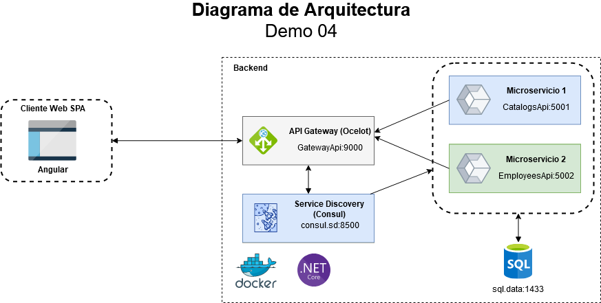

# Demo Microservicios
## Demo de .NET Core - API Gateway y Service Discovery

# Instrucciones

Para correr el proyecto puede realizarlo utilizando docker a través de docker-compose. Ejecute el siguiente comando:

    docker-compose up --build

# Arquitectura

# Contenedores

Se desplegarán en contenedores cada componente de la arquitectura, los cuales son:

    http://localhost:9000/api <- API Gateway (.NET 6.0)
    http://localhost:8500 <- Consul (Service Discovery)
    http://localhost:5001/api <- CatalogsAPI (.NET 6.0)
    http://localhost:5002/api <- EmployeesAPI (.NET 6.0)
    -host: localhost -port: 1433 <- Base de Datos (SQL Server)

# Tarea

El microservicio EmployeesApi realiza operaciones CRUD y está completo. Sin embargo, se debe completar el microservicio CatalogsApi, se incluye únicamente la funcionalidad para:

    Countries
    Departaments

Se debe completar la funcionalidad para obtener:

    Regions
    Locations
    Dependents
    Jobs